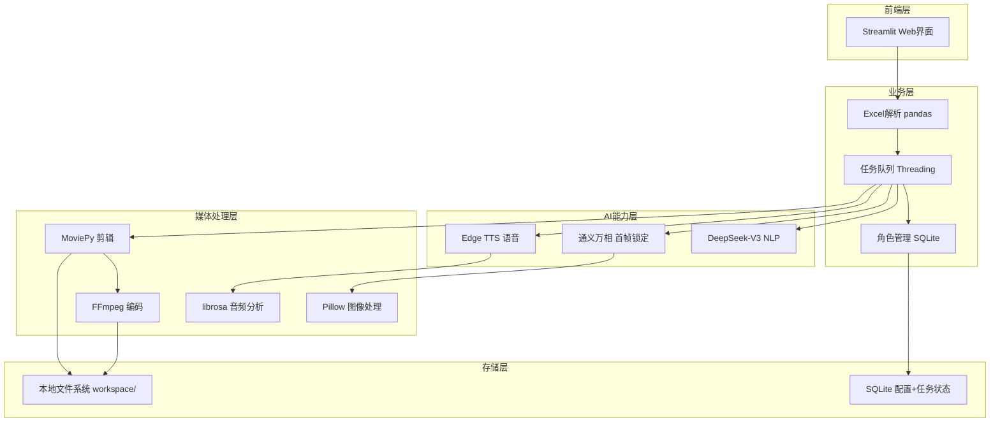

# 织影（ZhìYǐng）产品需求文档 V2.0

**产品形态**：本地化AI短剧生产工具（Web界面版）  
**核心差异**：零云成本 + 首帧角色锁定 + Excel批量驱动  
**日期**：2024-02-24

---

## 1. 产品定位（一句话）

**织影是一款基于首帧锁定技术的本地化AI短剧工厂，通过Web界面实现"Excel剧本→AI分镜→本地渲染"的全自动流水线，让单人创作者以零云服务器成本日产10条角色一致的剧情短视频。**

---

## 2. 目标用户画像（3类典型用户）

| 用户类型 | 典型场景 | 核心痛点 | 使用频率 |
|---------|---------|---------|---------|
| **网文工作室**（1-3人团队） | 将知乎盐选/番茄小说转为短视频引流，运营10+矩阵号 | 手动剪辑产能瓶颈（人均日产1条）；AI工具角色"变脸"导致观众出戏 | 高频（日产3-10条） |
| **知识类剧情博主**（历史/科普/商业IP） | 将历史事件、商业案例剧情化演绎 | 缺乏拍摄团队；真人出镜成本高；需要专业分镜降低门槛 | 中频（周更3条） |
| **短剧二创剪辑师**（个体MCN） | 平台授权素材快速生成"前5集免费"引流视频 | 版权查重严格；需改变画面风格但保留剧情；批量生产矩阵内容 | 高频（日产5-20条） |

---

## 3. 核心功能列表（按用户价值排序，含详细验收标准）

### P0 - 首帧角色锁定与AI生成（Character Lock）

**描述**：上传1张角色参考图，通过通义万相"首帧锁定"技术确保该角色在全剧集中外貌、服装、风格100%一致，替代传统预置动画素材。

- **AC1**：支持PNG/JPG上传（建议512×512以上），自动提取角色特征生成"角色卡"，本地SQLite存储特征向量
- **AC2**：基于单张参考图生成连续5个分镜，人脸识别相似度≥90%（使用face-api.js本地比对，非肉眼判断）
- **AC3**：支持跨剧本复用：已创建角色可在新项目中直接调用，无需重新上传
- **AC4**：首帧锁定生成失败时（API限流/网络异常），自动重试3次，仍失败则使用"风格描述+随机种子"降级生成，不阻塞流程
- **AC5**：生成进度实时反馈：显示"生图进度 3/12 → 视频化 3/12 → 合成中"（Streamlit进度条组件）

### P0 - Excel批量剧本工厂（Batch Pipeline）

**描述**：通过标准化Excel模板（角色/台词/情绪/知识点列）批量导入，支持一次提交3个剧本自动排队，本地SQLite持久化防丢。

- **AC1**：Excel模板自动校验：必须包含"角色/台词/情绪"三列，缺失时高亮提示并阻止提交；支持一键下载标准模板
- **AC2**：批量队列管理：支持同时提交3个剧本排队，显示实时状态（等待/生图中/渲染中/完成），支持暂停/删除任务
- **AC3**：断点续传：软件意外关闭后重启，自动恢复未完成的任务队列（基于SQLite事务日志，非内存存储）
- **AC4**：任务隔离：单个任务失败（如某分镜生图失败）不阻塞队列，自动跳过并生成错误报告，后续任务继续执行

### P0 - 智能分镜与语音时间轴（Smart Storyboard）

**描述**：DeepSeek解析剧本生成带运镜建议的分镜，Edge TTS生成语音后使用librosa自动计算精确时间轴。

- **AC1**：输入1000-5000字文本，DeepSeek自动拆解为5-12个分镜，包含景别（特写/中景/全景）和运镜建议（推/拉/摇/移）
- **AC2**：情绪-镜头映射：识别"紧张/悬疑"情绪时推荐快切特写（2秒/镜），"温馨/科普"时推荐慢推中景（4秒/镜）
- **AC3**：语音合成：基于Edge TTS为每句台词生成MP3，支持多角色音色映射（阿梗/晓晓/云希等），失败重试3次，仍失败使用默认音占位
- **AC4**：智能时间轴：使用librosa分析语音时长，生成JSON时间轴（精确到毫秒），自动计算每句台词起止时间，误差<100ms
- **AC5**：可视化时间轴：Streamlit卡片式展示分镜，显示"台词+语音波形缩略图+预计时长"，支持拖拽调整顺序

### P0 - 本地化渲染引擎（Local Rendering）

**描述**：基于MoviePy+FFmpeg在本地完成音画合成，支持字幕叠加、BGM混音、多分辨率输出，无需上传云端。

- **AC1**：视频规格：默认输出1080×1920@30fps（9:16竖屏），H.264编码，码率≤8Mbps；可选16:9横屏（自动智能裁剪居中）
- **AC2**：字幕生成：根据时间轴自动生成SRT字幕，支持自定义字体（本地TTF文件）、颜色、描边（防底色混淆），与语音同步误差<100ms
- **AC3**：BGM合成：自动降低背景音乐音量（淡入淡出-20dB），与语音混音输出；支持MP3/WAV格式，自动循环截取匹配视频长度
- **AC4**：本地文件管理：自动创建workspace/项目名/目录，分阶段保存素材（语音片段audio/、图片序列images/、成品output/、字幕subtitles/）
- **AC5**：渲染性能：1分钟语音素材总处理时长<3分钟（含AI生图+合成），单视频处理峰值内存<4GB，FFmpeg线程数限制为2防止卡顿

### P1 - 零成本配置与异常容错（Zero-Cost Setup）

**描述**：引导配置国内免费API，完善异常处理与日志，确保非技术用户可独立使用。

- **AC1**：API向导：首次启动引导输入DeepSeek Key→测试连通性→输入通义万相Key→本地加密存储（SQLite加密字段），实时显示剩余额度
- **AC2**：成本预警：通义万相当日积分<10分时，弹窗提示"剩余X积分，预计还可生成Y个分镜，建议明日继续"
- **AC3**：异常处理：覆盖8种异常场景（Excel格式错误/素材缺失/磁盘空间不足/FFmpeg失败等），每种异常给出明确中文提示（如"❌ 磁盘空间不足，请清理output目录"）
- **AC4**：日志系统：详细记录每步处理时间、Token消耗、错误堆栈，日志分级（DEBUG/INFO/ERROR），支持导出batch_report.json统计报告
- **AC5**：素材热替换：用户可替换字体（assets/fonts/）、BGM（assets/bgm/）、默认背景，遵循约定目录结构实时生效，无需重启软件

---

## 4. 用户旅程（从Excel到MP4的5步闭环）

| 步骤 | 用户操作 | 系统响应 | 关键技术 | 预计耗时 |
|-----|---------|---------|---------|---------|
| **1. 启动** | 双击start.bat，自动打开浏览器localhost:8501 | 检查Python环境，首次自动安装依赖（requirements.txt），加载SQLite数据库 | Streamlit server启动脚本 | 30s（首次2min） |
| **2. 配置** | 输入DeepSeek和通义万相API Key，点击"测试并保存" | 验证Key有效性，显示各API剩余额度（DeepSeek 500万Token/月，通义万相50积分/日），加密存储到本地SQLite | st.secrets加密存储 + API连通性测试 | 1min |
| **3. 上传** | 拖拽Excel到上传区（含角色/台词/情绪/知识点列） | pandas解析Excel，校验三列格式，标记缺失列，显示角色列表供映射 | pandas读取 + 列名校验（正则过滤特殊字符防注入） | 10s |
| **4. 设定** | 为每个角色上传PNG图片，点击"锁定首帧" | 生成本地角色卡（缩略图+特征缓存），展示一致性测试图（3张预览） | Pillow图像处理 + SQLite特征存储 | 2min |
| **5. 预览** | 查看DeepSeek生成的分镜卡片（画面描述+运镜+语音试听） | 流式调用DeepSeek API解析分镜，Edge TTS生成3秒语音样本，librosa计算预估时长 | 流式API调用 + librosa音频分析 | 30s-1min |
| **6. 调整** | 拖拽调整分镜顺序，或点击"重绘"修改某分镜 | 实时重新计算总时长，重新生成指定分镜（消耗API额度），更新JSON时间轴 | Streamlit session state管理 | 即时 |
| **7. 制片** | 点击"开始制作"，选择分辨率（9:16或16:9） | 任务加入Python Threading队列，SQLite记录状态，显示进度条（生图 3/12 → 视频化 3/12 → 合成中） | Threading异步 + SQLite事务 | 10-15min（后台） |
| **8. 交付** | 在"历史记录"页预览成品，点击下载 | 提供MP4下载+SRT字幕文件+项目源文件ZIP（含所有素材便于二次编辑） | FFmpeg本地合成完成 | 即时 |

**批量生产模式**：
- 支持一次性提交3个Excel文件进入队列
- 显示队列看板：处理中（1/3）/ 等待中（2）/ 已完成（1）
- 支持断点续传：关闭浏览器后重启，自动恢复未完成任务

---

## 5. 技术架构示意

**技术栈详情**：

- **前端界面**：Streamlit（纯Python，零前端代码）
- **业务逻辑**：Python 3.9+，pandas（Excel解析），numpy（数据处理）
- **数据持久化**：SQLite（单文件，加密存储API密钥和任务状态）
- **任务队列**：Python Threading（标准库，避免引入Celery/Redis复杂度）
- **媒体处理**：MoviePy（视频剪辑），FFmpeg（编码合成），librosa（音频分析），Pillow（图像处理）
- **AI能力**：DeepSeek-V3（NLP，500万Token/月免费），通义万相Wan2.2（视觉，50积分/日免费），Edge TTS（语音，完全免费）
- **安全保障**：路径校验（防目录遍历），输入过滤（防Excel注入），资源限制（单文件<10MB，内存<4GB）

**部署方式**：

- **开发模式**：`streamlit run app/main.py`（热更新）
- **生产模式**：PyInstaller打包为独立EXE（Windows）或APP（Mac），双击start.bat/start.sh自动安装依赖并启动
- **零成本基础**：仅需Python 3.9+环境，所有数据本地存储（无云服务费用）

**下一步里程碑**：

1. **Week 1**：完成首帧角色锁定+Excel上传解析（验证通义万相API集成）
2. **Week 2**：完成DeepSeek分镜+Edge TTS语音+librosa时间轴（跑通端到端流程）
3. **Week 3**：完成MoviePy+FFmpeg合成+批量队列+断点续传（支持周更3条产能）
4. **Week 4**：异常处理完善+PyInstaller打包+使用文档（开源发布就绪）

---

*文档版本：V2.0*  
*最后更新：2024-02-24*
