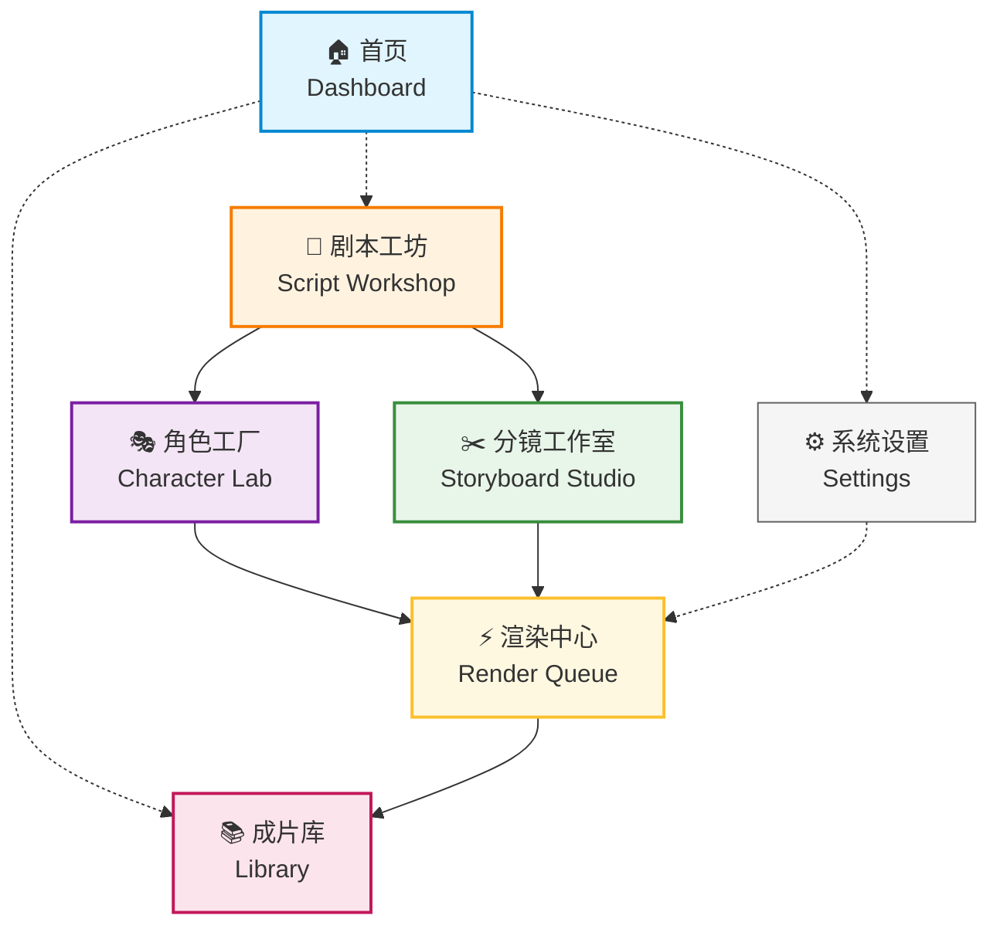
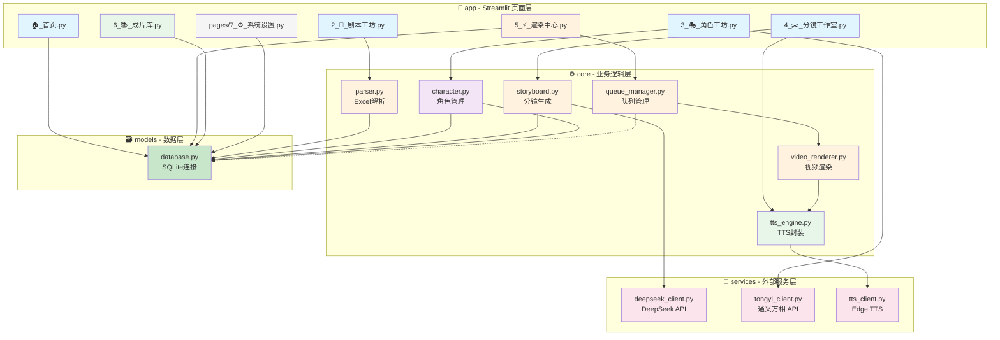

# ReelForge 粗粒度模块依赖图

**项目**：影工厂 (ReelForge)  
**版本**：v1.0  
**日期**：2026-03-20  
**阶段**：P2.4 架构决策  
**上游依赖**：@docs/01-requirements/PRD-v1.0.locked.md, @docs/02-architecture/tech-stack-decision.md, @docs/02-architecture/module-design.md  

---

## 1. 模块节点定义

基于 PRD V2.0 的 "6+1 模块化结构"，定义以下业务模块（仅业务层，不含技术实现层）：

| 序号 | 模块名（中文） | 模块名（英文） | 职责描述 | 对应 PRD 功能 |
|:---:|:---|:---|:---|:---|
| 1 | **首页** | dashboard | API额度监控、快速开始、项目统计 | P1-零成本配置：AC1（API额度显示）、AC2（成本预警） |
| 2 | **剧本工坊** | script_workshop | Excel批量上传、智能解析、项目管理 | P0-Excel批量剧本工厂：AC1-AC4 |
| 3 | **角色工厂** | character_lab | 首帧上传、角色管理、一致性测试 | P0-首帧角色锁定：AC1-AC5 |
| 4 | **分镜工作室** | storyboard_studio | AI分镜生成、时间轴编辑、运镜控制 | P0-智能分镜与语音时间轴：AC1-AC5 |
| 5 | **渲染中心** | render_queue | 视频合成、队列管理、断点续传 | P0-本地化渲染引擎：AC1-AC5 |
| 6 | **成片库** | library | 视频资产管理、批量导出、软删除 | P1-零成本配置：AC4（日志导出） |
| 7 | **系统设置** | settings | API密钥管理、素材热替换、存储清理 | P1-零成本配置：AC1（API向导）、AC5（素材热替换） |

### 模块核心数据流

```
Excel剧本 → 剧本工坊 → 角色工厂 → 分镜工作室 → 渲染中心 → 成片库
                ↓           ↓            ↓            ↓
            解析存储    首帧锁定     AI分镜生成    视频合成     成品输出
```

---

## 2. 依赖关系图（Mermaid）

### 2.1 业务模块依赖图（粗粒度）



### 2.2 依赖关系说明

| 依赖方向 | 关系类型 | 说明 |
|:---------|:---------|:-----|
| Dashboard -.-> Script | 导航跳转 | 首页快速开始入口，跳转至剧本上传 |
| Dashboard -.-> Library | 导航跳转 | 首页显示最近成片，可点击进入 |
| Dashboard -.-> Settings | 导航跳转 | 首页 API 状态提示，点击进入配置 |
| Script --> Character | 数据依赖 | 剧本解析后需为角色绑定首帧 |
| Script --> Storyboard | 数据依赖 | Excel 内容传递给分镜生成器 |
| Character --> Render | 数据依赖 | 角色首帧图片用于视频渲染 |
| Storyboard --> Render | 数据依赖 | 分镜数据（画面+语音）驱动渲染队列 |
| Render --> Library | 数据依赖 | 渲染完成输出至成片库 |
| Settings -.-> Render | 配置影响 | API 密钥、渲染参数影响渲染行为 |

---

### 2.3 完整技术栈依赖图（含实现层）



---

## 3. DAG 验证报告

### 3.1 无环性验证

| 验证项 | 结果 | 说明 |
|:-------|:----:|:-----|
| 业务模块层 | ✅ | Dashboard → Script → Character/Storyboard → Render → Library，无循环 |
| 技术实现层 | ✅ | app → core → models，services 被 core 单向调用 |
| 跨层依赖 | ✅ | 无反向依赖（database 不依赖任何 business 层） |

### 3.2 依赖方向规则

```
┌─────────────────────────────────────────────────────────────┐
│                    依赖方向规则（强制）                       │
├─────────────────────────────────────────────────────────────┤
│  Presentation (app)                                         │
│       ↓                                                     │
│  Business (core)                                            │
│       ↓                                                     │
│  Data (models) ←──── services 提供外部服务                   │
│                                                              │
│  禁止反向依赖：                                              │
│  ✗ core 不能 import app                                     │
│  ✗ models 不能 import core                                  │
│  ✗ services 不能 import core（通过参数传递）                 │
└─────────────────────────────────────────────────────────────┘
```

### 3.3 模块职责单一性验证

| 模块 | 变更理由 | 验证结果 |
|:-----|:---------|:--------:|
| Dashboard | API额度显示逻辑变更 | ✅ 单一职责 |
| Script | Excel解析规则变更 | ✅ 单一职责 |
| Character | 首帧锁定算法变更 | ✅ 单一职责 |
| Storyboard | 分镜生成策略变更 | ✅ 单一职责 |
| Render | 视频合成方式变更 | ✅ 单一职责 |
| Library | 视频存储格式变更 | ✅ 单一职责 |
| Settings | 配置项管理变更 | ✅ 单一职责 |

---

## 4. 与上游文档对齐

### 4.1 与 PRD V2.0 对齐

| PRD 章节 | PRD 描述 | 本模块对应 | 对齐状态 |
|:---------|:---------|:-----------|:--------:|
| 3.1 P0-首帧角色锁定 | Character Lock | character_lab | ✅ |
| 3.2 P0-Excel批量剧本工厂 | Batch Pipeline | script_workshop | ✅ |
| 3.3 P0-智能分镜与语音时间轴 | Smart Storyboard | storyboard_studio | ✅ |
| 3.4 P0-本地化渲染引擎 | Local Rendering | render_queue | ✅ |
| 3.5 P1-零成本配置 | Zero-Cost Setup | dashboard + settings | ✅ |
| 4. 用户旅程 | 8步闭环 | 6+1 模块覆盖全部步骤 | ✅ |

### 4.2 与 tech-stack-decision.md 对齐

| 决策项 | tech-stack-decision.md | 本图体现 | 对齐状态 |
|:-------|:-----------------------|:---------|:--------:|
| 前端框架 | Streamlit 1.29.0 | Presentation 层 | ✅ |
| 数据库 | SQLite | Data 层 database | ✅ |
| 并发模型 | Threading | QueueMgr 单 worker | ✅ |
| AI 服务 | DeepSeek+通义万相+Edge | Service 层 | ✅ |
| 目录结构 | app/core/models/services | 四层结构 | ✅ |

### 4.3 与 module-design.md 对齐

| module-design.md 模块 | 本图节点 | 路径对应 | 对齐状态 |
|:----------------------|:---------|:---------|:--------:|
| dashboard | Dashboard | app/🏠_首页.py | ✅ |
| script_workshop | Script | app/2_📑_剧本工坊.py | ✅ |
| character_lab | Character | app/3_🎭_角色工坊.py | ✅ |
| storyboard_studio | Storyboard | app/4_✂️_分镜工作室.py | ✅ |
| render_queue | Render | app/5_⚡_渲染中心.py | ✅ |
| library | Library | app/6_📚_成片库.py | ✅ |
| settings | Settings | app/pages/7_⚙️_系统设置.py | ✅ |

---

## 5. 阻断条件检查（P2.4 → P3）

进入 Step 3（详细设计）前必须确认：

- [ ] **模块数量 ≤ 7**：确认 PRD 的 6+1 结构完整映射
  - [x] 首页 (Dashboard)
  - [x] 剧本工坊 (Script Workshop)
  - [x] 角色工厂 (Character Lab)
  - [x] 分镜工作室 (Storyboard Studio)
  - [x] 渲染中心 (Render Queue)
  - [x] 成片库 (Library)
  - [x] 系统设置 (Settings)

- [ ] **DAG 无环验证**：确认依赖图无循环依赖
  - [x] 业务模块层：Dashboard → Script → Character/Storyboard → Render → Library
  - [x] 技术实现层：app → core → models
  - [x] 无反向依赖

- [ ] **技术约束满足**：确认与 project-config.yaml 约束一致
  - [x] zero-cloud-cost：所有服务层模块使用免费 API
  - [x] sqlite-only：Data 层仅 database 模块
  - [x] threading：QueueMgr 使用 Threading 模型
  - [x] single-developer：模块边界清晰，单人可维护

---

## 附录：文档引用

### 上游输入

| 文档 | 路径 | 用途 |
|:-----|:-----|:-----|
| PRD V2.0 | `@docs/01-requirements/PRD-v1.0.locked.md` | 6+1 模块化结构、功能需求 |
| 技术栈决策 | `@docs/02-architecture/tech-stack-decision.md` | 技术约束、目录结构 |
| 模块详细设计 | `@docs/02-architecture/module-design.md` | 模块定义、接口契约 |

### 下游依赖

| 文档 | 路径 | 依赖关系 |
|:-----|:-----|:---------|
| 数据库 Schema | `@docs/02-architecture/database-schema.sql` | 基于模块数据流设计表关系 |
| 接口定义 | `@docs/05-coding/interface-definitions/*.py` | 基于模块边界定义接口 |

---

**文档元数据**

| 属性 | 值 |
|:-----|:---|
| **文档编号** | DG-2026-001 |
| **版本** | v1.0 |
| **创建日期** | 2026-03-20 |
| **作者** | 架构依赖分析师 |
| **审核状态** | 待确认 |
| **下游阶段** | Step 3 - 详细设计 |

---

*本文档遵循《通用行动列表》P2.4 规范生成，与影工厂 (ReelForge) 项目技术架构保持一致。*
