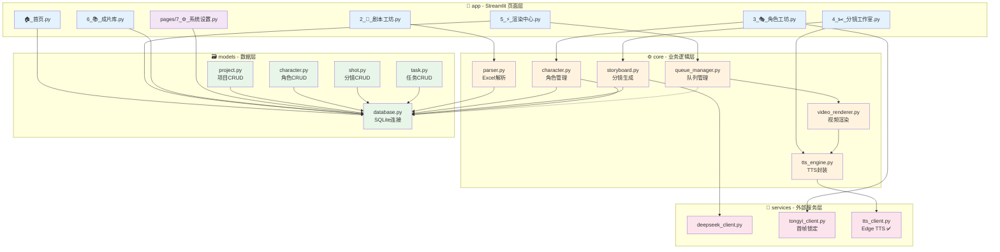

# ReelForge 模块详细设计（Module Design）

**项目**：影工厂 (ReelForge)  
**版本**：v1.0  
**日期**：2026-03-20  
**状态**：Step 3 详细设计  
**上游依赖**：@docs/01-requirements/PRD-v1.0.locked.md, @docs/02-architecture/tech-stack-decision.md  

---

## 1. 模块清单（与 PRD 6+1 页面对齐）

基于 PRD V2.0 第 5 节 "用户旅程" 和界面流程，映射为 6+1 模块化结构：

| 序号 | 模块名（中文） | 模块名（英文） | 职责 | 类型 | 路径 | 依赖 |
|:---|:---|:---|:---|:---|:---|:---|
| 1 | **首页** | dashboard | API额度监控、快速开始、项目统计 | presentation | `app/🏠_首页.py` | database |
| 2 | **剧本工坊** | script_workshop | Excel批量上传、智能解析、项目管理 | business | `app/2_📑_剧本工坊.py` | database, excel_parser |
| 3 | **角色工厂** | character_lab | 首帧锁定、一致性测试、音色映射 | business | `app/3_🎭_角色工坊.py` | database, tongyi_client |
| 4 | **分镜工作室** | storyboard_studio | 时间轴编辑、AI画面描述、运镜控制 | business | `app/4_✂️_分镜工作室.py` | database, deepseek_client, tts_client |
| 5 | **渲染中心** | render_queue | 三列Kanban看板、断点续传、实时日志 | business | `app/5_⚡_渲染中心.py` | database, queue_manager, video_renderer |
| 6 | **成片库** | library | 视频资产管理、批量导出、软删除 | business | `app/6_📚_成片库.py` | database |
| 7 | **系统设置** | settings | API密钥管理、素材热替换、存储清理 | infrastructure | `app/pages/7_⚙️_系统设置.py` | database, config |

### 模块与 PRD 功能映射

| PRD 功能 | 所属模块 | AC 覆盖 |
|:---------|:---------|:--------|
| 首帧角色锁定与AI生成 (P0) | character_lab | AC1-AC5 |
| Excel批量剧本工厂 (P0) | script_workshop | AC1-AC4 |
| 智能分镜与语音时间轴 (P0) | storyboard_studio | AC1-AC5 |
| 本地化渲染引擎 (P0) | render_queue + video_renderer | AC1-AC5 |
| 零成本配置与异常容错 (P1) | settings + dashboard | AC1-AC5 |

---

## 2. 基础设施层（与织影文档 4.1 节对齐）

### 2.1 目录结构总览

```
reelforge/                      # 项目根目录（原 zhiying）
├── 📱 app/                     # Layer 1: Presentation (Streamlit)
│   ├── 🏠_首页.py
│   ├── 2_📑_剧本工坊.py
│   ├── 3_🎭_角色工坊.py
│   ├── 4_✂️_分镜工作室.py
│   ├── 5_⚡_渲染中心.py
│   ├── 6_📚_成片库.py
│   └── pages/
│       └── 7_⚙️_系统设置.py
│
├── ⚙️ core/                    # Layer 2: Business Logic
│   ├── __init__.py
│   ├── parser.py               # Excel解析 (excel_parser)
│   ├── storyboard.py           # 分镜生成器
│   ├── character.py            # 角色特征管理
│   ├── tts_engine.py           # TTS引擎封装
│   ├── video_renderer.py       # 视频渲染器 (video_renderer)
│   └── queue_manager.py        # 任务队列管理 (queue_manager)
│
├── 🗃️ models/                  # Layer 3: Data Access
│   ├── __init__.py
│   ├── database.py             # 数据库连接 (database)
│   ├── project.py              # 项目表CRUD
│   ├── character.py            # 角色表CRUD
│   ├── shot.py                 # 分镜表CRUD
│   └── task.py                 # 任务队列表CRUD
│
└── 🔌 services/                # Layer 4: External Services
    ├── __init__.py
    ├── deepseek_client.py      # DeepSeek API (deepseek_client)
    ├── tongyi_client.py        # 通义万相 API (tongyi_client)
    └── tts_client.py           # Edge TTS客户端 (tts_client)
```

### 2.2 底层模块详细定义

#### database（基础设施层 - Infrastructure）

**定位**：SQLite 连接池、事务管理、软删除基础能力

| 属性 | 说明 |
|:-----|:-----|
| **类型** | infrastructure |
| **路径** | `models/database.py` |
| **状态** | ✅ 已实现 (2026-04-03) |
| **接口版本** | v1.0 (已锁定) |
| **测试覆盖率** | > 80% (44个测试) |
| **约束** | 函数<50行，圈复杂度<10，类型注解100%，无async/await |

**输入/输出契约**：

| 方法 | 输入 | 输出 | 异常 |
|:-----|:-----|:-----|:-----|
| `query(sql, params)` | SQL字符串, 可选参数元组 | `Iterator[sqlite3.Row]`（懒加载） | `ConnectionError`（连接失败）, `DatabaseError`（执行失败） |
| `execute(sql, params)` | SQL字符串, 可选参数元组 | `int`（影响行数） | `DatabaseError`, `IntegrityError` |
| `transaction()` | 无 | 上下文管理器 | `TransactionError`（嵌套事务） |
| `get_conn()` | 无 | `sqlite3.Connection` | `PoolExhaustedError`（连接池耗尽） |

**异常体系**：
- `DatabaseError`: 数据库操作失败的基类
- `ConnectionError`: 无法建立数据库连接
- `PoolExhaustedError`: 连接池无可用连接（默认池大小：5）
- `TransactionError`: 事务嵌套或回滚失败

---

#### queue_manager（基础设施层 - Infrastructure）

**定位**：persist-queue 封装、线程安全的任务调度

| 属性 | 说明 |
|:-----|:-----|
| **类型** | infrastructure |
| **路径** | `core/queue_manager.py` |
| **约束** | Threading 模型，禁用 async/await |

**输入/输出契约**：

| 方法 | 输入 | 输出 | 异常 |
|:-----|:-----|:-----|:-----|
| `enqueue(task_dict)` | `dict` 含 `project_id`, `priority` | `str`（task_id） | `QueueFullError`（队列满，max=3）, `ValidationError`（参数缺失） |
| `dequeue()` | 无 | `dict`（task_dict） | `QueueEmptyError`（阻塞超时） |
| `get_status(task_id)` | `str`（task_id） | `TaskStatus` 枚举 | `TaskNotFoundError` |
| `register_callback(task_id, callback)` | task_id, Callable | 无 | `TaskNotFoundError` |
| `start_worker()` | 无 | 无 | `WorkerDeadError`（线程异常退出） |
| `pause/resume/stop()` | 无 | 无 | 无 |

**状态机**：
```
queued → processing → completed
   ↓         ↓           ↓
pending   failed      cancelled
```

**异常体系**：
- `QueueFullError`: 队列达到最大容量（3个任务）
- `QueueEmptyError`: 队列为空且阻塞超时
- `WorkerDeadError`: 工作线程异常退出
- `TaskNotFoundError`: 任务ID不存在

---

#### excel_parser（业务层 - Business）

**定位**：pandas 解析、列名校验、数据清洗

| 属性 | 说明 |
|:-----|:-----|
| **类型** | business |
| **路径** | `core/parser.py` |
| **依赖** | pandas, openpyxl |

**输入/输出契约**：

| 方法 | 输入 | 输出 | 异常 |
|:-----|:-----|:-----|:-----|
| `parse(file_path)` | `Path`（Excel文件路径） | `List[ScriptLine]` | `ValidationError`（列名缺失）, `FormatError`（格式错误） |
| `validate_columns(df)` | `DataFrame` | `List[str]`（缺失列名） | 无（返回空列表表示通过） |
| `extract_roles(df)` | `DataFrame` | `List[str]`（角色名列表） | 无 |

**数据模型 ScriptLine**：
```python
@dataclass
class ScriptLine:
    sequence: int           # 序号
    character: str          # 角色名（必填）
    dialogue: str           # 台词（必填）
    emotion: str            # 情绪（必填）
    knowledge: Optional[str] = None  # 知识点（可选）
    camera: Optional[str] = None     # 运镜（可选）
    bgm: Optional[str] = None        # BGM（可选）
    duration: Optional[float] = None # 时长（可选，秒）
```

**异常体系**：
- `ValidationError`: 必填列缺失（角色/台词/情绪）
- `FormatError`: Excel格式错误（非.xlsx/.xls，或无法解析）
- `EmptyFileError`: 文件为空或只有表头

---

#### video_renderer（业务层 - Business）

**定位**：MoviePy 封装、FFmpeg 调用、音画合成

| 属性 | 说明 |
|:-----|:-----|
| **类型** | business |
| **路径** | `core/video_renderer.py` |
| **依赖** | moviepy, ffmpeg-python, librosa |

**输入/输出契约**：

| 方法 | 输入 | 输出 | 异常 |
|:-----|:-----|:-----|:-----|
| `render(shots, config)` | `List[Shot]`, `RenderConfig` | `Path`（输出视频路径） | `RenderError`（渲染失败）, `FFmpegNotFoundError` |
| `validate_ffmpeg()` | 无 | `bool` | `FFmpegNotFoundError`（系统未安装FFmpeg） |
| `estimate_duration(shots)` | `List[Shot]` | `float`（预估秒数） | 无 |
| `generate_subtitles(shots)` | `List[Shot]` | `Path`（SRT文件路径） | `SubtitleError` |

**数据模型 Shot**：
```python
@dataclass
class Shot:
    sequence: int
    dialogue: str
    audio_path: Path          # TTS生成的语音文件
    image_path: Path          # AI生成的画面
    duration: float           # 精确时长（librosa计算）
    subtitle_start: float     # 字幕开始时间
    subtitle_end: float       # 字幕结束时间
```

**数据模型 RenderConfig**：
```python
@dataclass
class RenderConfig:
    resolution: Tuple[int, int] = (1080, 1920)  # 默认竖屏9:16
    fps: int = 30
    codec: str = "libx264"
    bitrate: str = "8000k"
    audio_codec: str = "aac"
    audio_bitrate: str = "192k"
    subtitle_font: Optional[Path] = None
    subtitle_color: str = "#FFFFFF"
    bgm_path: Optional[Path] = None
    bgm_volume: float = 0.2   # BGM音量（相对于语音）
```

**异常体系**：
- `RenderError`: 渲染过程失败（MoviePy异常封装）
- `FFmpegNotFoundError`: 系统未安装FFmpeg或不在PATH
- `SubtitleError`: 字幕生成失败（字体缺失等）
- `ResourceError`: 素材文件不存在或无法读取

---

#### deepseek_client（服务层 - Service）

**定位**：DeepSeek API 客户端、流式响应、重试逻辑

| 属性 | 说明 |
|:-----|:-----|
| **类型** | service |
| **路径** | `services/deepseek_client.py` |
| **约束** | 必须带 @retry 装饰器（tenacity） |

**输入/输出契约**：

| 方法 | 输入 | 输出 | 异常 |
|:-----|:-----|:-----|:-----|
| `generate_storyboard(script, roles)` | `str`（剧本全文）, `List[str]`（角色列表） | `Storyboard`（分镜对象） | `APIError`, `RateLimitError`, `TimeoutError` |
| `stream_generate(script)` | `str` | `Iterator[str]`（流式chunks） | `APIError`, `ConnectionError` |
| `validate_key(api_key)` | `str` | `Tuple[bool, str]`（是否有效，余额信息） | `APIError` |

**数据模型 Storyboard**：
```python
@dataclass
class Storyboard:
    shots: List[ShotDescription]  # 分镜列表
    total_duration: float         # 预估总时长
    
@dataclass  
class ShotDescription:
    sequence: int
    scene_description: str        # 画面描述（用于生图）
    dialogue: str
    emotion: str
    camera_movement: str          # 运镜建议（推/拉/摇/移）
    shot_type: str                # 景别（特写/中景/全景）
```

**异常体系**：
- `APIError`: API调用失败（4xx/5xx错误）
- `RateLimitError`: 触发速率限制（429）
- `TimeoutError`: 请求超时（默认60s）
- `ParseError`: 响应解析失败（JSON格式错误）

**重试策略**：
```python
@retry(
    stop=stop_after_attempt(3),
    wait=wait_exponential(multiplier=1, min=1, max=8),
    retry=retry_if_exception_type((APIError, TimeoutError))
)
```

---

#### tongyi_client（服务层 - Service）

**定位**：通义万相首帧锁定 API 客户端

| 属性 | 说明 |
|:-----|:-----|
| **类型** | service |
| **路径** | `services/tongyi_client.py` |
| **约束** | 首帧锁定代码必须包含 `# TODO: 降级策略` 标记 |

**输入/输出契约**：

| 方法 | 输入 | 输出 | 异常 |
|:-----|:-----|:-----|:-----|
| `generate_with_first_frame(prompt, first_frame_path)` | `str`（提示词）, `Path`（首帧图片） | `Path`（生成的图片） | `APIError`, `CharacterMismatchError` |
| `validate_character_consistency(images)` | `List[Path]` | `float`（相似度分数0-100） | `FaceDetectionError` |
| `get_quota_remaining()` | 无 | `int`（剩余积分） | `APIError` |

**异常体系**：
- `APIError`: API调用失败
- `CharacterMismatchError`: 生成图片与首帧角色不一致（相似度<90%）
- `FaceDetectionError`: 无法检测人脸（首帧图片质量问题）
- `QuotaExceededError`: 当日积分耗尽

**降级策略**（# TODO: 降级策略）：
```python
try:
    result = self.generate_with_first_frame(prompt, first_frame_path)
except (APIError, CharacterMismatchError) as e:
    # TODO: 降级策略 - 使用风格描述+固定种子生成
    result = self.generate_with_style_fallback(prompt, style_description)
```

---

#### tts_client（服务层 - Service）

**定位**：Edge TTS 客户端、音色映射、音频缓存

| 属性 | 说明 |
|:-----|:-----|
| **类型** | service |
| **路径** | `services/tts_client.py` |
| **状态** | ✅ 已实现 (2026-04-02) |
| **接口版本** | v1.0 (已锁定) |
| **测试覆盖率** | ≥ 80% |
| **依赖** | `edge-tts==7.2.7`, `tenacity` |

**输入/输出契约**：

| 方法 | 输入 | 输出 | 异常 |
|:-----|:-----|:-----|:-----|
| `synthesize(text, voice_profile)` | `str`（文本）, `str`（音色标识） | `Path`（MP3文件路径） | `TTSError`, `TimeoutError`, `VoiceNotFoundError` |
| `estimate_duration(text, voice_profile)` | `str`, `Optional[str]` | `float`（预估秒数） | 无 |
| `get_voices()` | 无 | `List[VoiceProfile]` | 无 |
| `get_voice_mapping()` | 无 | `Dict[str, str]` | 无 |
| `clear_cache(older_than_days)` | `int` | `int`（清理文件数） | 无 |
| `default_voice` (property) | 无 | `str` | 无 |
| `cache_dir` (property) | 无 | `Path` | 无 |

**音色映射表**（来自 @prompts/project-config.yaml）：
| 角色类型 | Voice ID | 描述 |
|:---------|:---------|:-----|
| 旁白 | zh-CN-XiaoxiaoNeural | 晓晓（女声通用） |
| 男性角色 | zh-CN-YunxiNeural | 云希（男声青年） |
| 女性角色 | zh-CN-XiaoyiNeural | 晓伊（女声温柔） |
| 老年角色 | zh-CN-YunjianNeural | 云健（男声老年） |

**实现特性**：
1. **异步到同步转换**：Edge TTS 是异步库，本项目禁止 async/await，使用 `asyncio.new_event_loop()` 同步包装
2. **音频缓存**：SQLite 缓存数据库 + 文件系统缓存，支持过期清理
3. **重试机制**：`@retry` 装饰器处理网络超时和 API 失败（3次重试，指数退避）
4. **音色验证**：后台线程验证音色可用性，使用预定义中文音色作为后备
5. **时长预估**：基于历史缓存数据或默认语速（3字符/秒）估算

**异常体系**：
- `TTSError`: TTS合成失败（基类）
- `TimeoutError`: 网络超时（Edge TTS需访问微软服务器）
- `VoiceNotFoundError`: 音色ID不存在

---

## 3. 接口契约详细定义

### 3.1 database 模块契约（基础设施层核心）

```python
# models/database.py
from contextlib import contextmanager
from typing import Iterator, Optional, Tuple, Any
import sqlite3
from pathlib import Path


class DatabaseError(Exception):
    """数据库操作失败的基类"""
    pass


class ConnectionError(DatabaseError):
    """无法建立数据库连接"""
    pass


class PoolExhaustedError(ConnectionError):
    """连接池无可用连接"""
    pass


class TransactionError(DatabaseError):
    """事务嵌套或回滚失败"""
    pass


class Database:
    """
    SQLite数据库连接管理器
    
    职责：
    - 连接池管理（默认5个连接）
    - 事务上下文管理
    - 软删除基础支持
    """
    
    def __init__(self, db_path: str = "workspace/reelforge.db", pool_size: int = 5):
        """
        初始化数据库连接池
        
        Args:
            db_path: 数据库文件路径
            pool_size: 连接池大小
            
        Raises:
            ConnectionError: 无法创建数据库目录或初始化连接
        """
        pass
    
    def query(
        self, 
        sql: str, 
        params: Optional[Tuple[Any, ...]] = None
    ) -> Iterator[sqlite3.Row]:
        """
        执行查询语句（SELECT）
        
        Args:
            sql: SQL查询字符串
            params: 查询参数（防注入）
            
        Returns:
            行迭代器（懒加载，内存友好）
            
        Raises:
            ConnectionError: 无法获取连接
            DatabaseError: SQL执行错误
        """
        pass
    
    def execute(
        self, 
        sql: str, 
        params: Optional[Tuple[Any, ...]] = None
    ) -> int:
        """
        执行修改语句（INSERT/UPDATE/DELETE）
        
        Args:
            sql: SQL执行字符串
            params: 执行参数
            
        Returns:
            影响行数
            
        Raises:
            DatabaseError: SQL执行错误
            IntegrityError: 约束冲突（唯一键等）
        """
        pass
    
    @contextmanager
    def transaction(self):
        """
        事务上下文管理器
        
        使用示例：
            with db.transaction() as conn:
                conn.execute("INSERT...")
                conn.execute("UPDATE...")
        
        Yields:
            sqlite3.Connection: 数据库连接
            
        Raises:
            TransactionError: 嵌套事务不支持
        """
        pass
    
    def get_conn(self) -> sqlite3.Connection:
        """
        获取原始连接（高级用法，需自行管理事务）
        
        Returns:
            sqlite3.Connection: 数据库连接
            
        Raises:
            PoolExhaustedError: 连接池耗尽
        """
        pass
    
    def init_tables(self) -> None:
        """初始化表结构（如果不存在）"""
        pass
```

### 3.2 queue_manager 模块契约（并发关键）

```python
# core/queue_manager.py
from enum import Enum, auto
from typing import Callable, Dict, Optional, Any
from dataclasses import dataclass
from pathlib import Path


class TaskStatus(Enum):
    """任务状态枚举"""
    QUEUED = auto()      # 等待中
    PENDING = auto()     # 暂停
    PROCESSING = auto()  # 处理中
    COMPLETED = auto()   # 完成
    FAILED = auto()      # 失败
    CANCELLED = auto()   # 取消


class QueueError(Exception):
    """队列操作错误基类"""
    pass


class QueueFullError(QueueError):
    """队列已满"""
    pass


class QueueEmptyError(QueueError):
    """队列空（阻塞超时）"""
    pass


class WorkerDeadError(QueueError):
    """工作线程异常退出"""
    pass


class TaskNotFoundError(QueueError):
    """任务ID不存在"""
    pass


@dataclass
class Task:
    """任务对象"""
    task_id: str
    project_id: int
    priority: int = 0
    status: TaskStatus = TaskStatus.QUEUED
    progress: int = 0  # 0-100
    current_step: str = ""
    error_msg: Optional[str] = None
    created_at: Optional[float] = None
    started_at: Optional[float] = None
    completed_at: Optional[float] = None


class RenderQueue:
    """
    渲染任务队列管理器
    
    职责：
    - 基于 persist-queue 的持久化队列
    - Threading 单 worker 模型
    - 状态回调机制
    - 断点续传支持
    """
    
    MAX_QUEUE_SIZE: int = 3  # 最大队列长度
    
    def __init__(self, db_path: str = "workspace/queue"):
        """
        初始化队列管理器
        
        Args:
            db_path: 队列持久化目录
        """
        pass
    
    def enqueue(
        self, 
        task_dict: Dict[str, Any]
    ) -> str:
        """
        添加任务到队列
        
        Args:
            task_dict: 任务字典，必须包含 'project_id'
            
        Returns:
            task_id: 任务唯一标识
            
        Raises:
            QueueFullError: 队列已满（MAX_QUEUE_SIZE=3）
            ValidationError: task_dict 缺少必需字段
        """
        pass
    
    def dequeue(self, block: bool = True, timeout: Optional[float] = None) -> Task:
        """
        从队列取出任务
        
        Args:
            block: 是否阻塞等待
            timeout: 阻塞超时时间（秒）
            
        Returns:
            Task: 任务对象
            
        Raises:
            QueueEmptyError: 队列为空且非阻塞/超时
        """
        pass
    
    def get_status(self, task_id: str) -> TaskStatus:
        """
        查询任务状态
        
        Args:
            task_id: 任务ID
            
        Returns:
            TaskStatus: 当前状态
            
        Raises:
            TaskNotFoundError: 任务不存在
        """
        pass
    
    def register_callback(
        self, 
        task_id: str, 
        callback: Callable[[TaskStatus, int, str], None]
    ) -> None:
        """
        注册状态变更回调
        
        Args:
            task_id: 任务ID
            callback: 回调函数(status, progress, step)
            
        Raises:
            TaskNotFoundError: 任务不存在
        """
        pass
    
    def start_worker(self) -> None:
        """
        启动后台工作线程
        
        Raises:
            WorkerDeadError: 工作线程已异常退出
        """
        pass
    
    def pause(self) -> None:
        """暂停队列处理（当前任务完成后暂停）"""
        pass
    
    def resume(self) -> None:
        """恢复队列处理"""
        pass
    
    def stop(self, timeout: float = 5.0) -> None:
        """
        停止工作线程
        
        Args:
            timeout: 等待超时时间（秒）
        """
        pass
    
    def get_all_tasks(self) -> list[Task]:
        """
        获取所有任务状态（用于 Kanban 看板）
        
        Returns:
            List[Task]: 任务列表
        """
        pass
```

### 3.3 video_renderer 模块契约（业务核心）

```python
# core/video_renderer.py
from dataclasses import dataclass
from typing import List, Optional, Tuple
from pathlib import Path
import numpy as np


class RenderError(Exception):
    """渲染失败基类"""
    pass


class FFmpegNotFoundError(RenderError):
    """FFmpeg未安装"""
    pass


class SubtitleError(RenderError):
    """字幕生成失败"""
    pass


class ResourceError(RenderError):
    """素材资源错误"""
    pass


@dataclass
class ShotClip:
    """分镜片段数据"""
    sequence: int
    dialogue: str
    audio_path: Path
    image_path: Path
    duration: float
    subtitle_start: float
    subtitle_end: float


@dataclass
class RenderConfig:
    """渲染配置"""
    resolution: Tuple[int, int] = (1080, 1920)
    fps: int = 30
    codec: str = "libx264"
    bitrate: str = "8000k"
    audio_codec: str = "aac"
    audio_bitrate: str = "192k"
    subtitle_font: Optional[Path] = None
    subtitle_color: str = "#FFFFFF"
    subtitle_stroke: bool = True
    bgm_path: Optional[Path] = None
    bgm_volume: float = 0.2
    output_format: str = "mp4"


class VideoRenderer:
    """
    视频渲染引擎
    
    职责：
    - MoviePy 音画合成
    - FFmpeg 编码输出
    - 字幕生成与叠加
    - BGM混音
    """
    
    MAX_MEMORY_GB: float = 4.0  # 峰值内存限制
    
    def __init__(self, ffmpeg_path: Optional[str] = None):
        """
        初始化渲染器
        
        Args:
            ffmpeg_path: FFmpeg可执行文件路径（None则使用系统PATH）
        """
        pass
    
    def validate_ffmpeg(self) -> bool:
        """
        检查 FFmpeg 是否可用
        
        Returns:
            bool: 是否可用
            
        Raises:
            FFmpegNotFoundError: FFmpeg未安装或路径错误
        """
        pass
    
    def render(
        self, 
        shots: List[ShotClip], 
        config: RenderConfig,
        progress_callback: Optional[Callable[[int, str], None]] = None
    ) -> Path:
        """
        渲染视频
        
        Args:
            shots: 分镜片段列表
            config: 渲染配置
            progress_callback: 进度回调(progress_pct, step_name)
            
        Returns:
            Path: 输出视频文件路径
            
        Raises:
            RenderError: 渲染过程失败
            ResourceError: 素材文件不存在
            FFmpegNotFoundError: FFmpeg不可用
        """
        pass
    
    def estimate_duration(self, shots: List[ShotClip]) -> float:
        """
        预估总时长
        
        Args:
            shots: 分镜片段列表
            
        Returns:
            float: 预估秒数
        """
        pass
    
    def generate_subtitles(
        self, 
        shots: List[ShotClip],
        output_path: Path,
        config: RenderConfig
    ) -> Path:
        """
        生成 SRT 字幕文件
        
        Args:
            shots: 分镜片段列表
            output_path: 输出路径
            config: 渲染配置（字体、颜色等）
            
        Returns:
            Path: SRT文件路径
            
        Raises:
            SubtitleError: 字幕生成失败
        """
        pass
    
    def preview_frame(
        self, 
        shot: ShotClip, 
        config: RenderConfig,
        time_offset: float = 0.0
    ) -> np.ndarray:
        """
        生成预览帧（用于界面缩略图）
        
        Args:
            shot: 分镜片段
            config: 渲染配置
            time_offset: 时间偏移（秒）
            
        Returns:
            np.ndarray: 图像帧数据
        """
        pass
```

---

## 4. Mermaid 依赖图（DAG）



### DAG 验证说明

| 验证项 | 结果 | 说明 |
|:-------|:----:|:-----|
| 无循环依赖 | ✅ | 依赖方向：app → core → models，services 被 core 调用 |
| 依赖向内 | ✅ | 无反向依赖（database 不依赖任何 business 层） |
| 单一职责 | ✅ | 每个模块职责清晰，无跨层混合 |

---

## 5. 阻断条件检查（Blocking Checkpoints）

### 5.1 Step 3 → Step 4 前必须确认

| 检查项 | 状态 | 验证结果 |
|:-------|:----:|:---------|
| 模块数量 ≤ 7 | ✅ | 共 7 个（6 业务 + 1 设置），符合 PRD 6+1 结构 |
| 依赖图无环（DAG） | ✅ | Mermaid 图验证通过，无循环依赖 |
| 单一职责 | ✅ | 每个模块只有一个变更理由 |
| 依赖向内 | ✅ | app → core → models → services，无反向依赖 |

### 5.2 与已有文档对齐检查

| 检查项 | 来源 | 状态 | 说明 |
|:-------|:-----|:----:|:-----|
| 目录结构 | 织影文档 4.1 节 | ✅ | 根目录名改为 reelforge，其余结构一致 |
| 模块边界 | PRD V2.0 6+1 结构 | ✅ | 剧本工坊/角色工厂/分镜工作室/渲染中心/成片库/首页 均有对应 |
| 技术选型 | tech-stack-decision.md ADR-005 | ✅ | app/core/models/services 四层结构一致 |

### 5.3 关键模块覆盖检查

| PRD 功能模块 | 技术实现模块 | 状态 |
|:-------------|:-------------|:----:|
| Excel批量剧本工厂 | script_workshop + excel_parser | ✅ |
| 首帧角色锁定 | character_lab + tongyi_client | ✅ |
| 智能分镜 | storyboard_studio + deepseek_client | ✅ |
| 语音时间轴 | tts_engine + tts_client | ✅ (tts_client已实现) |
| 本地化渲染 | render_queue + video_renderer | ✅ |
| 任务队列 | queue_manager | ✅ |
| API配置 | settings | ✅ |

---

## 6. 阻断条件声明（P3 → P4）

进入 Step 4（数据建模）前必须人工确认：

- [ ] **确认模块依赖无环**：DAG 验证通过，无循环依赖
- [ ] **确认 PRD 的 6 个业务模块均有对应技术实现**：
  - [ ] 剧本工坊 → `app/2_📑_剧本工坊.py`
  - [ ] 角色工厂 → `app/3_🎭_角色工坊.py`  
  - [ ] 分镜工作室 → `app/4_✂️_分镜工作室.py`
  - [ ] 渲染中心 → `app/5_⚡_渲染中心.py`
  - [ ] 成片库 → `app/6_📚_成片库.py`
  - [ ] 首页 → `app/🏠_首页.py`
- [ ] **确认 database 模块为基础设施层**：被所有业务模块依赖，但自身无业务逻辑

---

## 附录 A：模块与接口定义对应关系

| 模块 | 接口定义文件 | 状态 |
|:-----|:-------------|:----:|
| database | `@docs/05-coding/interface-definitions/database-interface.v1.locked.py` | ✅ 已实现 (接口锁定) |
| queue_manager | `@docs/05-coding/interface-definitions/queue-interface.py` | ⏳ MISSING |
| video_renderer | `@docs/05-coding/interface-definitions/renderer-interface.py` | ⏳ MISSING |
| excel_parser | `@docs/05-coding/interface-definitions/parser-interface.py` | ⏳ MISSING |
| deepseek_client | `@docs/05-coding/interface-definitions/deepseek-interface.py` | ⏳ MISSING |
| tongyi_client | `@docs/05-coding/interface-definitions/tongyi-interface.py` | ⏳ MISSING |
| tts_client | `@docs/05-coding/interface-definitions/tts_client-interface.v1.locked.py` | ✅ 已实现 (接口锁定) |

---

## 附录 B：文档引用

### 上游输入

| 文档 | 路径 | 用途 |
|:-----|:-----|:-----|
| PRD V2.0 | `@docs/01-requirements/PRD-v1.0.locked.md` | 功能需求、模块边界定义 |
| 技术栈决策 | `@docs/02-architecture/tech-stack-decision.md` | 技术选型、目录结构约束 |
| 技术规范模板 | `@prompts/templates/tech-spec-template.md` | 接口契约格式 |

### 下游依赖

| 文档 | 路径 | 依赖关系 |
|:-----|:-----|:---------|
| 数据库 Schema | `@docs/02-architecture/database-schema.sql` | 基于 database 模块设计表结构 |
| 接口定义 | `@docs/05-coding/interface-definitions/*.py` | 基于本模块契约生成具体接口 |

---

**文档元数据**

| 属性 | 值 |
|:-----|:---|
| **文档编号** | MD-2026-001 |
| **版本** | v1.0 |
| **创建日期** | 2026-03-20 |
| **作者** | 解决方案架构师 |
| **审核状态** | 待确认 |
| **下游阶段** | Step 4 - 数据建模 |

---

*本文档遵循《通用行动列表》Step 3 规范生成，与影工厂 (ReelForge) 项目技术架构保持一致。*
