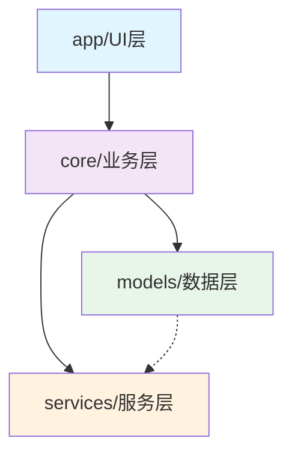
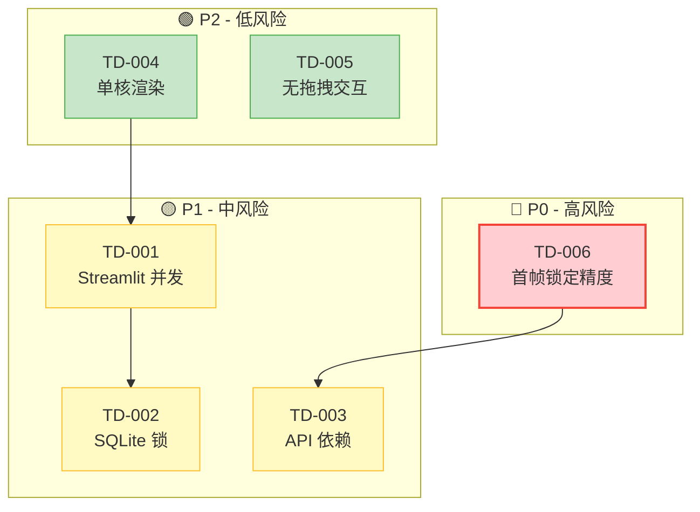

# 技术栈决策记录（Tech Stack ADR）

**项目**：影工厂 (ReelForge)  
**版本**：v1.0  
**日期**：2026-03-20  
**状态**：已冻结  

---

## 1. 决策概览

| 技术领域 | 选型方案 | 版本 | 约束来源 | 决策状态 |
|:---------|:---------|:-----|:---------|:---------|
| **前端框架** | Streamlit | 1.29.0 | @prompts/project-config.yaml / zero-cloud-cost, single-developer | ✅ 已冻结 |
| **后端语言** | Python | 3.9+ | @prompts/project-config.yaml | ✅ 已冻结 |
| **数据库** | SQLite | 3.x | @prompts/project-config.yaml / sqlite-only | ✅ 已冻结 |
| **任务队列** | persist-queue | 0.8.1 | @prompts/project-config.yaml | ✅ 已冻结 |
| **视频合成** | MoviePy + FFmpeg | 1.0.3 | @docs/02-architecture/织影技术架构设计文档_V1.0.md | ✅ 已冻结 |
| **并发模型** | Threading | - | @prompts/project-config.yaml / 禁用 async/await | ✅ 已冻结 |
| **NLP 服务** | DeepSeek API | deepseek-v3 | @prompts/project-config.yaml / zero-cloud-cost | ✅ 已冻结 |
| **图像生成** | 通义万相 | wanx2.1-t2i-plus | @prompts/project-config.yaml / first-frame-lock | ✅ 已冻结 |
| **TTS 服务** | Edge TTS | 6.1.9 | @prompts/project-config.yaml / zero-cloud-cost | ✅ 已冻结 |

---

## 2. 关键决策详细分析（ADR 格式）

### ADR-001：前端框架选择

| 维度 | 描述 |
|:-----|:-----|
| **背景** | 需要为单兵开发者提供快速构建 UI 的能力，同时满足零云成本约束（不购买服务器） |
| **决策** | 采用 Streamlit 1.29.0 作为前端框架 |
| **状态** | 已冻结（2026-03-20） |

#### 备选方案对比

| 方案 | 零云成本评分 | 单兵友好度 | 开发速度 | 部署复杂度 | 结论 |
|:-----|:------------:|:----------:|:--------:|:----------:|:-----|
| **Streamlit** | ⭐⭐⭐⭐⭐ | ⭐⭐⭐⭐⭐ | ⭐⭐⭐⭐⭐ | ⭐⭐⭐⭐⭐ (极简) | ✅ **选中** |
| React + FastAPI | ⭐⭐☆☆☆ (需Node构建) | ⭐⭐⭐☆☆ (双技术栈) | ⭐⭐⭐☆☆ | ⭐⭐☆☆☆ (复杂) | ❌ 否决 |
| Gradio | ⭐⭐⭐⭐⭐ | ⭐⭐⭐⭐☆ | ⭐⭐⭐⭐☆ | ⭐⭐⭐⭐⭐ (极简) | ⚠️ 次选 |
| PyQt/PySide | ⭐⭐⭐⭐⭐ | ⭐⭐⭐☆☆ (需桌面开发经验) | ⭐⭐⭐☆☆ | ⭐⭐⭐☆☆ (需打包) | ❌ 否决 |

#### 评分维度说明

- **零云成本评分**：是否需要额外服务器成本或构建工具
- **单兵友好度**：单人开发者从 0 到可运行界面的所需时间

#### 决策理由

1. **符合零云成本约束**：Streamlit 纯 Python 开发，无需 Node.js 构建环境，本地运行无需服务器
2. **单兵作战最优**：参考 @prompts/project-config.yaml 中 `single-developer` 约束，Streamlit 允许开发者用纯 Python 在数小时内构建出可用界面
3. **生态丰富**：内置数据表格、文件上传、进度条等组件，契合剧本工坊/分镜工作室需求

#### 技术债务

| 债务项 | 描述 | 影响 |
|:-------|:-----|:-----|
| TD-001 | Streamlit 无真并发，使用 Threading 模拟异步 | 高负载时响应延迟，详见第 3 节 |

---

### ADR-002：数据库选择

| 维度 | 描述 |
|:-----|:-----|
| **背景** | 需要本地化数据存储，满足零云成本和单兵维护约束 |
| **决策** | 采用 SQLite 作为唯一数据库引擎 |
| **状态** | 已冻结（2026-03-20），受 `sqlite-only` 硬性约束 |

#### 备选方案对比

| 方案 | 零云成本 | 单兵友好度 | 数据可控性 | 并发能力 | 运维复杂度 | 结论 |
|:-----|:--------:|:----------:|:----------:|:--------:|:----------:|:-----|
| **SQLite** | ⭐⭐⭐⭐⭐ | ⭐⭐⭐⭐⭐ | ⭐⭐⭐⭐⭐ | ⭐⭐☆☆☆ | ⭐⭐⭐⭐⭐ (零运维) | ✅ **选中** |
| PostgreSQL | ⭐⭐☆☆☆ (需安装服务) | ⭐⭐⭐☆☆ | ⭐⭐⭐⭐⭐ | ⭐⭐⭐⭐⭐ | ⭐⭐☆☆☆ (需配置) | ❌ 否决 |
| JSON 文件 | ⭐⭐⭐⭐⭐ | ⭐⭐⭐⭐⭐ | ⭐⭐⭐⭐⭐ | ⭐☆☆☆☆ | ⭐⭐⭐⭐⭐ | ❌ 否决 (无查询能力) |
| LiteDB (Python) | ⭐⭐⭐⭐⭐ | ⭐⭐⭐⭐☆ | ⭐⭐⭐⭐⭐ | ⭐⭐☆☆☆ | ⭐⭐⭐⭐⭐ | ⚠️ 次选 |

#### 决策理由

1. **sqlite-only 硬性约束**：根据 @prompts/project-config.yaml `constraints` 列表，项目明确限制使用 SQLite
2. **零运维成本**：无需安装/配置数据库服务，单文件即可运行
3. **Python 原生支持**：标准库 `sqlite3` 直接可用，无需额外依赖
4. **数据可控**：数据文件位于本地 `workspace/` 目录，完全由用户掌控

#### 技术债务

| 债务项 | 描述 | 影响 |
|:-------|:-----|:-----|
| TD-002 | SQLite 单文件锁限制并发写入 | 多线程同时写入时可能阻塞，需队列层协调 |

---

### ADR-003：并发模型

| 维度 | 描述 |
|:-----|:-----|
| **背景** | 视频渲染为 CPU 密集型任务，需要并发处理多个分镜；同时需满足代码约束 |
| **决策** | 采用 Threading（多线程）模型，禁用 Asyncio |
| **状态** | 已冻结（2026-03-20），受 `禁用 async/await` 约束 |

#### 备选方案对比

| 方案 | 单兵友好度 | 与 Streamlit 兼容性 | 代码复杂度 | 多核利用 | 决策依据 | 结论 |
|:-----|:----------:|:-------------------:|:----------:|:--------:|:---------|:-----|
| **Threading** | ⭐⭐⭐⭐⭐ | ⭐⭐⭐⭐⭐ | ⭐⭐⭐⭐⭐ | ⭐⭐☆☆☆ (GIL限制) | 符合约束 | ✅ **选中** |
| Asyncio | ⭐⭐⭐☆☆ | ⭐⭐☆☆☆ | ⭐⭐☆☆☆ | ⭐⭐☆☆☆ | 显式禁止 | ❌ 否决 |
| Celery + Redis | ⭐⭐☆☆☆ | ⭐⭐☆☆☆ | ⭐⭐☆☆☆ | ⭐⭐⭐⭐⭐ | 引入外部依赖 | ❌ 否决 |
| Multiprocessing | ⭐⭐⭐☆☆ | ⭐⭐⭐☆☆ | ⭐⭐☆☆☆ | ⭐⭐⭐⭐⭐ | 上下文切换开销大 | ⚠️ 次选 |

#### 决策理由

1. **禁用 async/await 约束**：根据 @prompts/project-config.yaml `forbidden_patterns`，显式禁止使用 async/await 模式
2. **Streamlit 兼容**：Streamlit 在 Threading 环境下运行稳定，asyncio 需特殊事件循环处理
3. **单兵可控**：Threading 代码直观易懂，调试成本低
4. **persist-queue 配合**：使用 persist-queue 实现任务持久化，单线程 worker 处理队列

#### 技术债务

| 债务项 | 描述 | 影响 |
|:-------|:-----|:-----|
| TD-004 | Threading 无法利用多核 CPU 进行视频编码 | 渲染性能受限，长视频处理耗时增加 |

---

### ADR-004：AI 服务集成

| 维度 | 描述 |
|:-----|:-----|
| **背景** | 需要 NLP（分镜生成）、图像生成（角色画面）、TTS（配音）三种 AI 能力，且满足零 API 成本约束 |
| **决策** | NLP: DeepSeek / 图像: 通义万相 / TTS: Edge TTS |
| **状态** | 已冻结（2026-03-20） |

#### 4.1 NLP 服务对比

| 方案 | 成本评估 | 中文能力 | 首帧锁定支持 | 稳定性 | 结论 |
|:-----|:---------|:--------:|:------------:|:------:|:-----|
| **DeepSeek-v3** | 500万 Token/月 免费 | ⭐⭐⭐⭐⭐ | ⭐⭐⭐⭐☆ | ⭐⭐⭐⭐☆ | ✅ **选中** |
| OpenAI GPT-4 | $0.03/1K tokens | ⭐⭐⭐⭐☆ | ⭐⭐⭐⭐☆ | ⭐⭐⭐⭐⭐ | ❌ 否决 (付费) |
| 文心一言 | 免费额度有限 | ⭐⭐⭐⭐⭐ | ⭐⭐⭐☆☆ | ⭐⭐⭐⭐☆ | ⚠️ 备选 |
| 本地 LLM (Llama) | 硬件成本高 | ⭐⭐⭐☆☆ | ⭐⭐☆☆☆ | ⭐⭐⭐☆☆ | ❌ 否决 (需GPU) |
| Claude | $0.008/1K tokens | ⭐⭐⭐⭐☆ | ⭐⭐⭐⭐☆ | ⭐⭐⭐⭐⭐ | ❌ 否决 (付费) |

#### 4.2 图像生成对比

| 方案 | 成本评估 | 首帧锁定 | 1080P 支持 | 国内访问 | 结论 |
|:-----|:---------|:--------:|:----------:|:--------:|:-----|
| **通义万相** | 50 积分/日 免费 | ⭐⭐⭐⭐⭐ | ⭐⭐⭐⭐⭐ | ⭐⭐⭐⭐⭐ | ✅ **选中** |
| Midjourney | $10/月 起 | ⭐⭐☆☆☆ | ⭐⭐⭐⭐⭐ | ⭐☆☆☆☆ (需代理) | ❌ 否决 |
| Stable Diffusion | 硬件成本高 | ⭐⭐⭐⭐☆ | ⭐⭐⭐☆☆ | ⭐⭐⭐⭐⭐ | ❌ 否决 (需GPU) |
| DALL-E 3 | $0.04/张 | ⭐⭐☆☆☆ | ⭐⭐⭐⭐☆ | ⭐⭐⭐☆☆ | ❌ 否决 (付费) |
| Leonardo.ai | 150 积分/日 | ⭐⭐☆☆☆ | ⭐⭐⭐⭐☆ | ⭐⭐⭐☆☆ | ⚠️ 备选 |

#### 4.3 TTS 服务对比

| 方案 | 成本评估 | 中文质量 | 情感控制 | 离线可用 | 结论 |
|:-----|:---------|:--------:|:--------:|:--------:|:-----|
| **Edge TTS** | 完全免费 | ⭐⭐⭐⭐☆ | ⭐⭐⭐☆☆ | ⭐⭐☆☆☆ | ✅ **选中** |
| Azure TTS | $16/百万字符 | ⭐⭐⭐⭐⭐ | ⭐⭐⭐⭐⭐ | ⭐☆☆☆☆ | ❌ 否决 (付费) |
| 百度语音合成 | 免费额度有限 | ⭐⭐⭐⭐☆ | ⭐⭐⭐☆☆ | ⭐⭐☆☆☆ | ⚠️ 备选 |
| Coqui TTS (本地) | 硬件成本 | ⭐⭐⭐☆☆ | ⭐⭐☆☆☆ | ⭐⭐⭐⭐⭐ | ❌ 否决 (模型大) |
| 讯飞语音 | 免费额度有限 | ⭐⭐⭐⭐⭐ | ⭐⭐⭐⭐☆ | ⭐⭐☆☆☆ | ⚠️ 备选 |

#### 成本量化汇总

| 服务 | 免费额度 | 超出成本 | 预计月成本 |
|:-----|:---------|:---------|:-----------|
| DeepSeek | 500万 Token/月 | ¥2/百万Token | ¥0 |
| 通义万相 | 50 积分/日 | ¥0.12/张 | ¥0 |
| Edge TTS | 无限制 | - | ¥0 |
| **总计** | - | - | **¥0** |

#### 决策理由

1. **零 API 成本运营**：三种服务均提供免费额度，满足个人开发者日常需求
2. **首帧锁定必需**：通义万相支持 `ref_image` 参数，是实现首帧角色锁定的关键
3. **国内访问稳定**：DeepSeek 和通义万相均为国内服务，Edge TTS 通过微软边缘网络访问

#### 技术债务

| 债务项 | 描述 | 影响 |
|:-------|:-----|:-----|
| TD-003 | 依赖第三方 API 可用性 | 任一服务调整策略将直接影响功能 |
| TD-005 | Edge TTS 无真情感控制 | 配音表现力受限，无法实现细腻情感变化 |

---

### ADR-005：目录结构

| 维度 | 描述 |
|:-----|:-----|
| **背景** | 需要清晰的代码组织，满足分层架构和单兵维护需求 |
| **决策** | 采用 `app/core/models/services` 四层结构 |
| **状态** | 已冻结（2026-03-20） |

#### 目录结构图

```
zhiying/
├── 📱 app/                 # Layer 1: UI 层 (Streamlit)
│   ├── 🏠 首页.py
│   ├── 2_📑_剧本工坊.py
│   ├── 3_🎭_角色工坊.py
│   ├── 4_✂️_分镜工作室.py
│   ├── 5_⚡_渲染中心.py
│   ├── 6_📚_成片库.py
│   └── 📁 utils/           # 页面级工具
│
├── ⚙️ core/                # Layer 2: 核心业务逻辑
│   ├── parser.py           # Excel解析
│   ├── storyboard.py       # 分镜生成
│   ├── character.py        # 角色管理
│   ├── tts_engine.py       # TTS封装
│   ├── video_renderer.py   # 视频渲染
│   └── queue_manager.py    # 队列管理
│
├── 🗃️ models/              # Layer 3: 数据模型 (SQLite)
│   ├── database.py         # 连接管理
│   ├── project.py          # 项目CRUD
│   ├── character.py        # 角色CRUD
│   ├── shot.py             # 分镜CRUD
│   └── task.py             # 任务CRUD
│
└── 🔌 services/            # Layer 4: 外部服务
    ├── deepseek_client.py  # DeepSeek API
    ├── tongyi_client.py    # 通义万相 API
    └── tts_client.py       # Edge TTS
```

#### 与通用规范对齐

| 本项目的层 | 通用规范 Step 3 分层 | 职责对应 |
|:-----------|:---------------------|:---------|
| `app/` | Presentation Layer | 用户界面、交互逻辑 |
| `core/` | Business Logic Layer | 核心业务规则、流程编排 |
| `models/` | Data Access Layer | 数据持久化、ORM/CRUD |
| `services/` | Integration Layer | 外部 API 封装、适配器 |

#### DAG 依赖验证



**依赖规则验证**：
- ✅ `app` 仅依赖 `core`
- ✅ `core` 依赖 `models` 和 `services`
- ✅ `models` 和 `services` 无相互依赖
- ✅ 无循环依赖（DAG 验证通过）

---

## 3. 技术债务总览

| 债务 ID | 描述 | 产生原因 | 风险等级 | 偿还时机 | 缓解方案 |
|:--------|:-----|:---------|:---------|:---------|:---------|
| **TD-001** | Streamlit 无真并发 | Streamlit 架构限制，仅支持 Threading 模拟 | P1 (中) | 用户量>10 时 | 使用 persist-queue 解耦 + 后台 Worker 线程 |
| **TD-002** | SQLite 单文件锁限制并发 | SQLite 文件级锁机制 | P1 (中) | 多用户同时编辑时 | 队列串行化写入 + 读副本模式 |
| **TD-003** | 第三方 API 依赖 | 零成本依赖免费服务 | P1 (中) | 服务策略变更时 | 抽象接口层 + 本地降级策略 |
| **TD-004** | MoviePy 单核渲染 | GIL + Threading 限制 | P2 (低) | 渲染>10 分钟时 | 分段渲染 + 后期合并 |
| **TD-005** | 无真拖拽交互 | Streamlit 无原生拖拽组件 | P2 (低) | 用户体验投诉时 | 使用 st-sortable 或上下箭头替代 |
| **TD-006** | 首帧锁定精度风险 | 通义万相 ref_image 效果不可控 | **P0 (高)** | 角色不一致反馈时 | 特征向量二次验证 + 人工确认机制 |

### 技术债务依赖图



**债务影响链说明**：
- TD-006 (首帧锁定) 依赖 TD-003 (API 可用)，若通义万相服务异常，首帧锁定功能失效
- TD-001 (Streamlit 并发) 与 TD-002 (SQLite 锁) 相互影响，高并发场景下需同时解决
- TD-004 (单核渲染) 在高负载时加剧 TD-001 的响应延迟问题

---

## 4. 决策冻结声明

### 4.1 冻结日期

**2026-03-20** - 所有关键技术决策在此日期冻结，进入实施阶段。

### 4.2 冻结项列表

| 冻结项 | 当前选型 | 变更影响 | 解冻条件 |
|:-------|:---------|:---------|:---------|
| 前端框架 | Streamlit 1.29.0 | 需重写全部 UI 代码 | React 版本能满足零云成本 |
| 数据库 | SQLite | 需迁移数据 + 重写 models 层 | 用户数>100 且并发需求明确 |
| 并发模型 | Threading | 需重构 queue_manager | 渲染速度>10 分钟且无法优化 |
| AI 服务 | DeepSeek+通义万相+Edge | 需重写 services 层 + 成本评估 | 任一服务取消免费额度 |
| 目录结构 | app/core/models/services | 需重构导入关系 | 发现循环依赖或职责混乱 |

### 4.3 变更流程

如需修改已冻结决策，必须执行以下流程：

```
┌─────────────────────────────────────────────────────────────┐
│  1. 创建 RFC (Request for Comments)                         │
│     → 文档路径：docs/RFC-{yyyy}-{nnn}-{topic}.md            │
│     → 内容：变更原因、影响分析、备选方案对比                 │
├─────────────────────────────────────────────────────────────┤
│  2. 重新执行 Step 2 架构设计                                 │
│     → 更新 @docs/02-architecture/tech-stack-decision.md     │
│     → 重新评估约束冲突 (project-config.yaml)                │
├─────────────────────────────────────────────────────────────┤
│  3. 评估逆向影响                                             │
│     → 检查下游依赖文档 (module-design.md, interface-defs)   │
│     → 评估代码重构范围                                        │
│     → 更新 document-lock.json                               │
├─────────────────────────────────────────────────────────────┤
│  4. 人机会合点确认                                           │
│     → 技术栈冻结变更需人工确认 (@prompts/project-config.yaml) │
└─────────────────────────────────────────────────────────────┘
```

### 4.4 风险触发条件

以下情况将触发技术栈重新评估：

| 触发条件 | 风险等级 | 应急预案 |
|:---------|:---------|:---------|
| DeepSeek 免费额度下调至 <100万 Token/月 | 🔴 高 | 切换至文心一言备选方案 |
| 通义万相取消免费额度 | 🔴 高 | 接入 Leonardo.ai 或本地 Stable Diffusion |
| 渲染速度 >10 分钟/条视频 | 🟡 中 | 引入 Multiprocessing 或分段渲染 |
| 多用户同时编辑冲突 >5 次/日 | 🟡 中 | 紧急评估 PostgreSQL 迁移 |
| Streamlit 停止维护 | 🟢 低 | 长期规划迁移至 Gradio |

---

## 5. 附录

### 5.1 验证检查清单

- [x] 所有决策与 @prompts/project-config.yaml 约束无冲突
  - [x] zero-cloud-cost: 无付费云服务依赖
  - [x] single-developer: 技术栈单人可维护
  - [x] sqlite-only: 无其他数据库引擎
  - [x] threading: 无 async/await 代码模式
- [x] 每项决策包含 ≥3 种备选方案对比
- [x] 技术债务包含偿还时机（P0/P1/P2）
- [x] 目录结构与 @docs/02-architecture/织影技术架构设计文档_V1.0.md 4.1 节一致
- [x] 目录结构 DAG 无循环依赖验证通过

### 5.2 引用文档

#### 上游输入（本决策依赖）

| 文档 | 路径 | 用途 |
|:-----|:-----|:-----|
| 项目配置 | @prompts/project-config.yaml | 约束来源、技术栈定义、API 配置 |
| 技术架构设计 | @docs/02-architecture/织影技术架构设计文档_V1.0.md | 目录结构、核心代码框架 |
| 文档协议 | @prompts/document-protocol.md | 引用格式规范 |

#### 下游依赖（依赖本决策）

| 文档 | 路径 | 依赖关系 |
|:-----|:-----|:---------|
| 模块详细设计 | @docs/02-architecture/module-design.md | 基于本决策的技术栈进行详细设计 |
| 数据库 Schema | @docs/02-architecture/database-schema.sql | 基于 SQLite 选型设计表结构 |
| 接口定义 | @docs/05-coding/interface-definitions/*.py | 基于目录结构分层编写 |
| 测试报告 | @docs/06-validation/test-report.md | 验证技术栈选型是否满足性能要求 |

#### 约束来源

| 约束项 | 来源文档 | 具体说明 |
|:-------|:---------|:---------|
| zero-cloud-cost | @prompts/project-config.yaml#L22 | `constraints` 列表第1项 |
| single-developer | @prompts/project-config.yaml#L24 | `constraints` 列表第3项 |
| sqlite-only | @prompts/project-config.yaml#L25 | `constraints` 列表第4项 |
| threading | @prompts/project-config.yaml#L133 | `forbidden_patterns` 禁用 async/await |
| 首帧锁定 | @prompts/project-config.yaml#L28 | `constraints` 列表第7项 |

---

## 文档元数据

| 属性 | 值 |
|:-----|:---|
| **文档编号** | ADR-2026-001 |
| **版本** | v1.0 |
| **创建日期** | 2026-03-20 |
| **冻结日期** | 2026-03-20 |
| **作者** | 架构决策记录（ADR）撰写专家 |
| **审核状态** | 待确认 |
| **下次评审** | 2026-04-20 或触发条件满足时 |

---

*本文档遵循《通用行动列表》规范生成，与影工厂 (ReelForge) 项目技术架构保持一致。*
